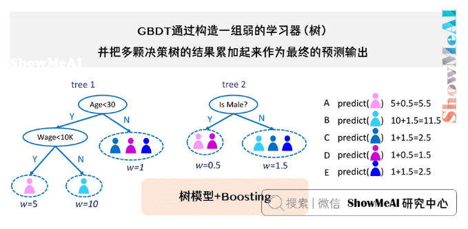
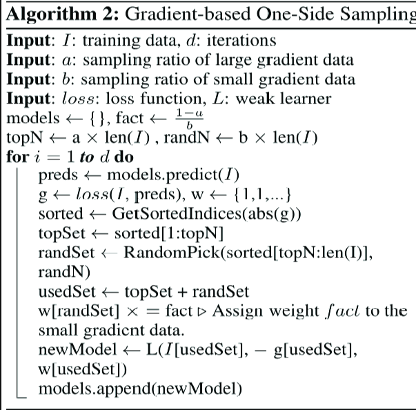
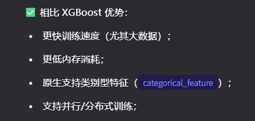
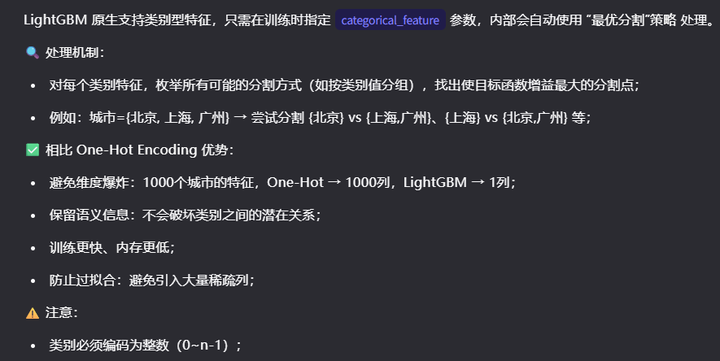
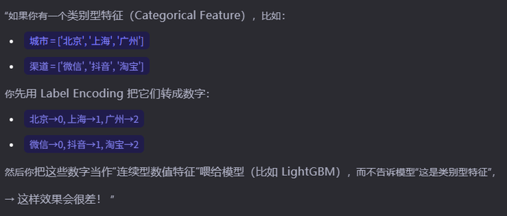
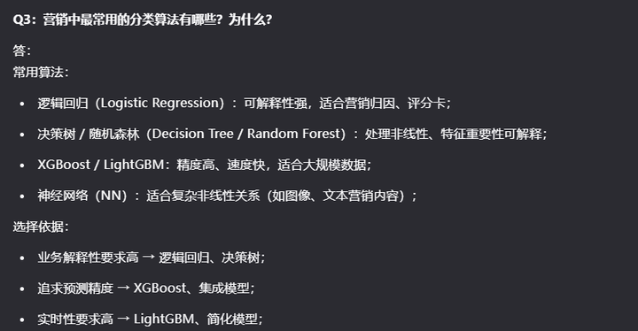
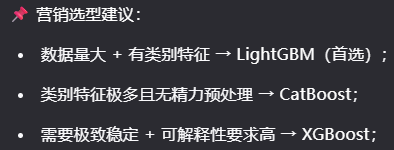

#一、lightgbm的出现缘由：
light的gradient boosting model,所以是源自gradient boost decision tree（如下）

解决gbdt的实现低效问题产生了lightgbm。
#二、light的点
##1.数据采样方面：gradient based one side sampling (GOSS)
梯度大的说明在上次树的学习中没有学好，有较大差异，所以在下个树的学习中，这部分样本进行保留，而梯度小的就可以删除一部分。具体就是按照梯度从大到小排序，大梯度采样比例为a，取a总样本量的样本，小梯度样本采样比例是b，随机从剩余的样本（认为是小梯度的样本）中随机采样bn，这个b小于1-a相当于在剩余我们认为是小梯度的样本中进行随机采样，这时候数据分布和原始数据分布就产生了差异，所以随机采样的样本要重新赋权，除以bn乘上（1-a)n，也就是乘（1-a)/b.

##2.exclusice featuer bunding(EFB)
将互斥（稀疏）特征捆绑 → 降低特征维度；
例如：用户是否点击A/B/C广告 → 三者互斥 → 可合并为一个“广告点击类型”特征；
##3.直方图算法（Histogram-based Algorithm）
将连续特征离散化为 bins（如 256 个桶），用 bin 索引代替原始值；
加速查找分裂点，减少内存占用；
##4.Leaf-wise 生长策略（vs XGBoost 的 Level-wise）
每次选择当前损失下降最大的叶子分裂 → 更快收敛、更高精度；
但可能过拟合 → 需配合 max_depth 控制；
#三、特长

##具体阐释：
###1、更快的训练速度
除了前面介绍的light的四点，还支持并行计算，以下三种并行
（1）特征并行
不同机器处理不同特征 → 找各自最佳分裂点 → 同步全局最佳；
适合特征多、数据量不大的情况；
（2）数据并行（Data Parallelism）
数据分片到不同机器 → 各自建直方图 → 合并直方图 → 找最佳分裂点；
适合数据量大、特征不多的情况；
（3）投票并行（Voting Parallelism） —— LightGBM 特有
在数据并行基础上，先局部投票选出 Top-K 特征 → 只合并这些特征的直方图；
减少通信开销，加速训练；
###2.更低内存消耗
因为前面介绍的light的点所以计算量很少
###3.原生支持类别型特征(categorical_feature)
处理机制：
对每个类别特征，枚举所有可能的分割方式（如按类别值分组），找出使目标函数增益最大的分割点；
例如：城市={北京, 上海, 广州} → 尝试分割 {北京} vs {上海,广州}、{上海} vs {北京,广州} 等；

原因：
（1）label encoding引入了虚假的数值大小关系
（2）树模型对连续特征的分裂方式不适合类别特征，树模型在分裂连续特征时会：if x > threshold: left, else: right，无法表达“北京 vs 其他”的合理分组；
（3）信息损失 + 模型表达能力受限
理想情况下，模型应该能自由组合任意类别子集，例如：

“北京和上海的用户行为相似 → 合并为一类” “抖音和淘宝用户高转化 → 与微信区分开” 

但 Label Encoding + 连续处理方式，限制了模型只能按“数值区间”分组，无法灵活表达类别组合。
补充：lightgbm是如何自动处理缺失值的？
原理：
训练时，对每个特征，分别尝试：
将缺失值分到左子树；
将缺失值分到右子树；
选择使损失下降最大的方向作为“默认方向”；
预测时，缺失值按默认方向走；
📌 注意：
缺失值会被当作一个“特殊状态”，有时反而包含信息（如“未填写职业”可能是学生/退休）；
不建议随意填充均值/众数，可能破坏信息；
四、什么时候用（和其他的模型的比较）

xgboost算法上和lightgbm的差异，导致的各自优缺点

添加图片注释，不超过 140 字（可选）

添加图片注释，不超过 140 字（可选）

添加图片注释，不超过 140 字（可选）

添加图片注释，不超过 140 字（可选）
五、怎么用
1.通过参数调优实现充分学习同时又不过拟合

添加图片注释，不超过 140 字（可选）
调参技巧

添加图片注释，不超过 140 字（可选）

添加图片注释，不超过 140 字（可选）

添加图片注释，不超过 140 字（可选）

使用自动调参工具：

添加图片注释，不超过 140 字（可选）
（1）optuna
import optuna

def objective(trial):
    params = {
        'objective': 'binary',
        'metric': 'auc',
        'boosting_type': 'gbdt',
        'num_leaves': trial.suggest_int('num_leaves', 32, 128),
        'learning_rate': trial.suggest_float('learning_rate', 0.01, 0.1, log=True),
        'feature_fraction': trial.suggest_float('feature_fraction', 0.6, 0.9),
        'bagging_fraction': trial.suggest_float('bagging_fraction', 0.6, 0.9),
        'bagging_freq': trial.suggest_int('bagging_freq', 1, 10),
        'min_data_in_leaf': trial.suggest_int('min_data_in_leaf', 20, 200),
        'lambda_l1': trial.suggest_float('lambda_l1', 1e-8, 10.0, log=True),
        'lambda_l2': trial.suggest_float('lambda_l2', 1e-8, 10.0, log=True),
        'verbose': -1,
        'seed': 42
    }

    model = lgb.train(
        params,
        train_data,
        valid_sets=[valid_data],
        num_boost_round=1000,
        callbacks=[lgb.early_stopping(stopping_rounds=30), lgb.log_evaluation(0)]
    )

    y_pred = model.predict(X_test, num_iteration=model.best_iteration)
    return roc_auc_score(y_test, y_pred)

study = optuna.create_study(direction='maximize')
study.optimize(objective, n_trials=50)

print("Best params:", study.best_params)
调参目的：充分学习同时也不要过拟合
哪些参数调整可以防止过拟合：
（1）正则化参数：
lambda_l1, lambda_l2：增加惩罚项；
min_gain_to_split：忽略增益小的分裂；
（2）限制树复杂度：

max_depth：控制树深；
num_leaves：控制叶子数（Leaf-wise 下更重要）；
min_data_in_leaf：叶子最少样本数；
（3）随机性引入：
feature_fraction < 1：每棵树随机选部分特征；
bagging_fraction < 1 + bagging_freq > 0：行采样；
（4）早停机制：
early_stopping_rounds：验证集指标不再提升即停；
（5）降低学习率 + 增加树数量：

小步慢跑更稳，配合早停；
（6）交叉验证：
使用 lgb.cv() 做 K 折验证选参；
特殊情况：数据不均衡参数调整

添加图片注释，不超过 140 字（可选）
（2）面对数据不均衡时做的其他调整

添加图片注释，不超过 140 字（可选）
（3）输出特征重要性
LightGBM 提供两种特征重要性：
Split Importance（默认）

特征被用于分裂的次数；
importance_type='split'
易偏向取值多的连续特征；
Gain Importance

特征带来的总信息增益（损失下降量）；
importance_type='gain'
更反映实际贡献，推荐用于营销归因；
六、评价结果
